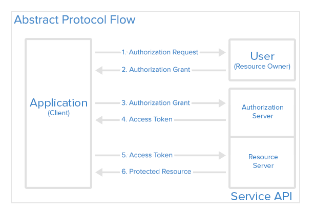
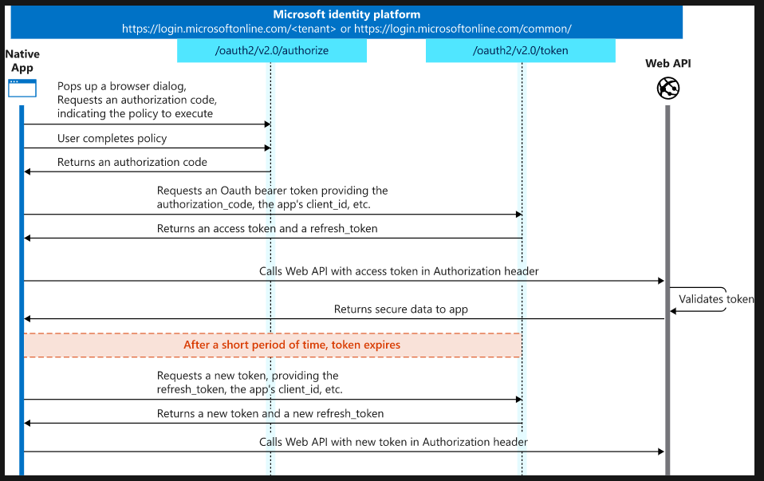
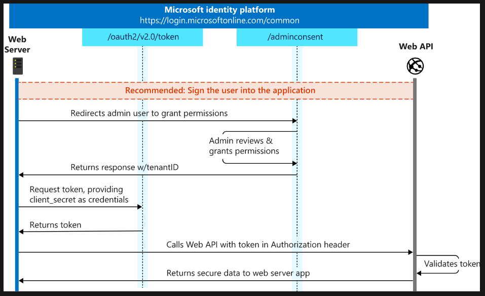
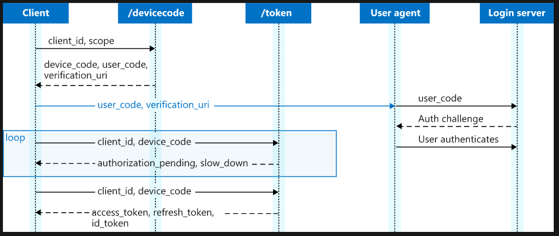
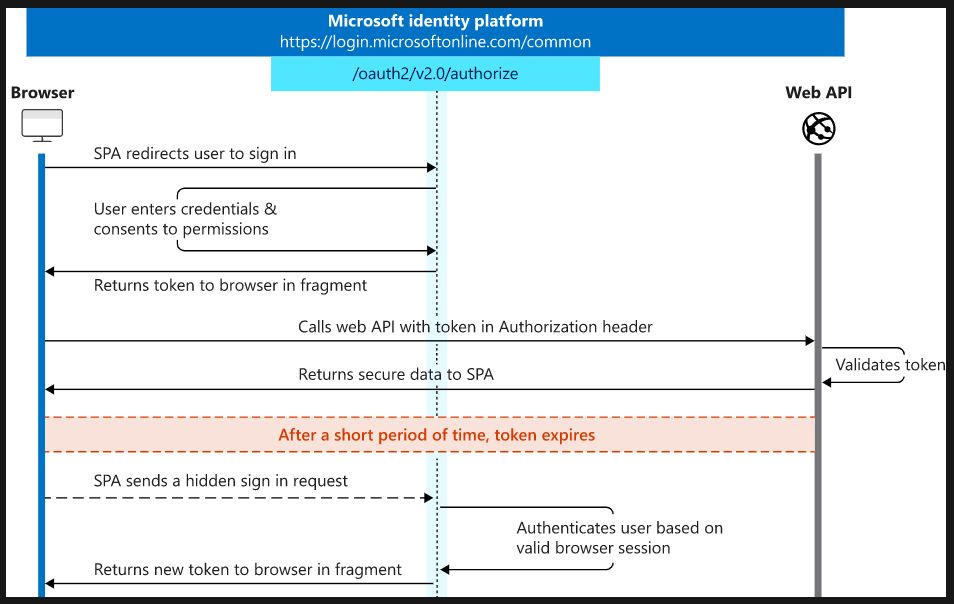
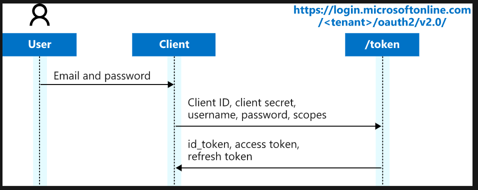

HTTP is a stateless protocol. However there are situations that we want our states to be stored. To overcome the stateless of HTTP requests, we could normally use either a session or token.
<br>

There are examples below.
<br>
<br>
***
source: https://medium.com/@sherryhsu/session-vs-token-based-authentication-11a6c5ac45e4


## 1. Session Based Authentication (stateful)

In the session based authentication, the server will create a session for the user after the user logs in. The session id is then stored on a cookie on the user’s browser. While the user stays logged in, the cookie would be sent along with every subsequent request. The server can then compare the session id stored on the cookie against the session information stored in the memory to verify user’s identity and sends response with the corresponding state


## 2. Token based Authentication (stateless)

 The server creates JWT with a secret and sends the JWT to the client. The client stores the JWT (usually in local storage) and includes JWT in the header with every request. The server would then validate the JWT with every request from the client and sends response.


<br>


*JWT token structure*

**Header** contains the type of token, which is JWT, and the singing algorithm. (Base 64 encoded)

```
{
  "alg": "HS256",
  "typ": "JWT"
}
```

**Payload** contains the claims. Claims are statements about an entity (typically, the user) and additional data. (Base 64 encoded)

```
{
  "sub": "1234567890",
  "name": "John Doe",
  "admin": true
}
```

**Signature** is encodWithSecret(encoded header + encoded payload). The secret is only visible in the server side and if any of data in header or/and payload has changed, JWT validation is failed due to wrong signature.


<br>
<br>
<br>
<br>
<br>


---
## Extra

#### Express Error handling (https://expressjs.com/en/guide/error-handling.html)

- In synchronous code  
  
  If synchronous code throws an error, then Express will catch and process it.

```javascript
app.get('/', function (req, res) {
  throw new Error('BROKEN') // Express will catch this on its own.
});
```
```
Response
{ "message" : "BROKEN" }
```

- For errors returned from asynchronous functions invoked by route handlers and middleware, you must pass them to the next() function, where Express will catch and process them

```javascript
app.get('/', function (req, res, next) {
  fs.readFile('/file-does-not-exist', function (err, data) {
    if (err) {
      next(err) // Pass errors to Express.
    } else {
      res.send(data)
    }
  })
})
```

- You must catch errors that occur in asynchronous code invoked by route handlers or middleware and pass them to Express for processing.

```javascript
app.get('/', function (req, res, next) {
  setTimeout(function () {
    try {
      throw new Error('BROKEN')
    } catch (err) {
      next(err)
    }
  }, 100)
})
```

- Use promises to avoid the overhead of the try..catch block or when using functions that return promises.

```javascript
app.get('/', function (req, res, next) {
  Promise.resolve().then(function () {
    throw new Error('BROKEN')
  }).catch(next) // Errors will be passed to Express.
})
```

---

## 3. OAuth 2.0

To access to protected data from a servier or application(Resource Server) for an user(Resource Owner), the client needs to be authorized by the user. When authorizing, it's safer and more secure than asking users to log in with passwords. Use OAuth to let application developers securely get access to the users' data without sharing their passwords.



### OAuth Grant Types

- Authorization Code

  The Authorization Code grant type is used by confidential and public clients to exchange an authorization code for an access token.

  After the user returns to the client via the redirect URL, the application will get the authorization code from the URL and use it to request an access token.

  It is recommended that all clients use the PKCE extension with this flow as well to provide better security.  
  https://oauth.net/2/pkce/

  


- Client Credential  
  The Client Credentials grant type is used by clients to obtain an access token outside of the context of a user.

  This is typically used by clients to access resources about themselves rather than to access a user's resources.

  

- Device Code

  The Device Code grant type is used by browserless or input-constrained devices in the device flow to exchange a previously obtained device code for an access token.

  

- Implicit (Legacy)

  The Implicit flow was a simplified OAuth flow previously recommended for native apps and JavaScript apps where the access token was returned immediately without an extra authorization code exchange step.

  It is not recommended to use the implicit flow (and some servers prohibit this flow entirely) due to the inherent risks of returning access tokens in an HTTP redirect without any confirmation that it has been received by the client.

  

- Resource Owner Password Credentials Grant (Legacy)

  The Password grant type is a way to exchange a user's credentials for an access token. Because the client application has to collect the user's password and send it to the authorization server, it is not recommended that this grant be used at all anymore.

  This flow provides no mechanism for things like multifactor authentication or delegated accounts, so is quite limiting in practice.

  


sources:  
https://docs.microsoft.com/en-us/azure/active-directory/develop/v2-oauth2-auth-code-flow
https://www.digitalocean.com/community/tutorials/an-introduction-to-oauth-2  
https://oauth.net/2/
